# Samples

Hand-picked input → output pairs from the corpus, rendered with the standard ARC color palette.

Each pair is one `(input, output)` instance the generator produced; the rule was applied via the Racket runner. Re-running `python3 scripts/build_samples.py` re-rolls them with the same seeds.

## `ecc04b33119c`

**Rule:** Tile 3×3 alternating original / LR-mirror by row block

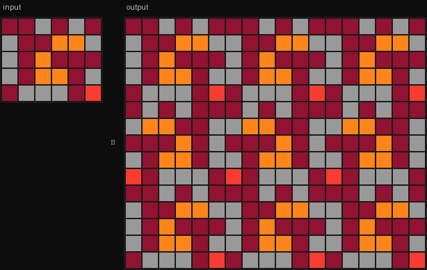

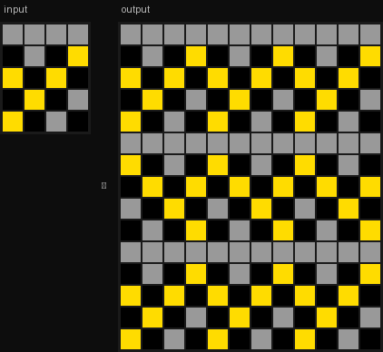

*test instance:*

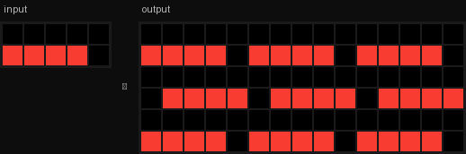

---

## `c4ab07496ad4`

**Rule:** Small shape determines big shape's color: plus→2, bottom-full→3, top-full→7

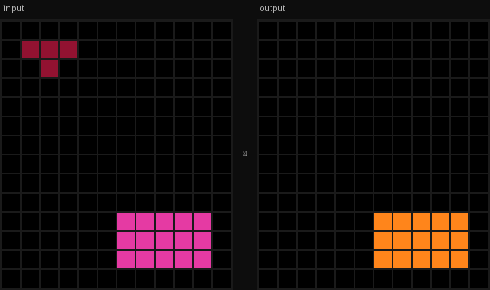

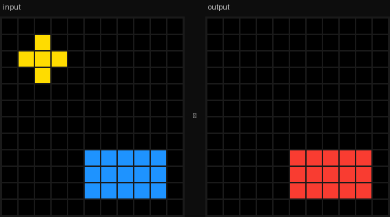

*test instance:*

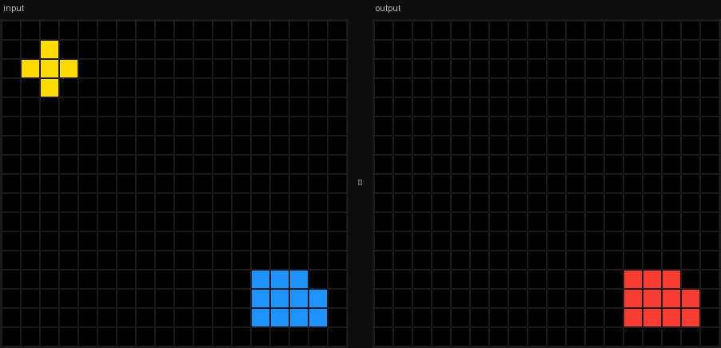

---

## `ad5998ad11d6`

**Rule:** Fill all enclosed regions with yellow(4)

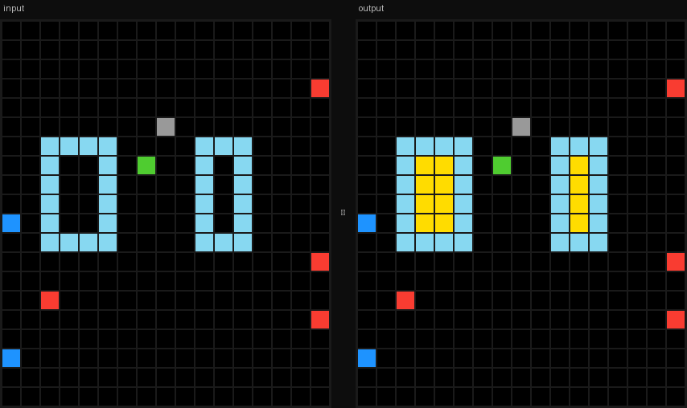

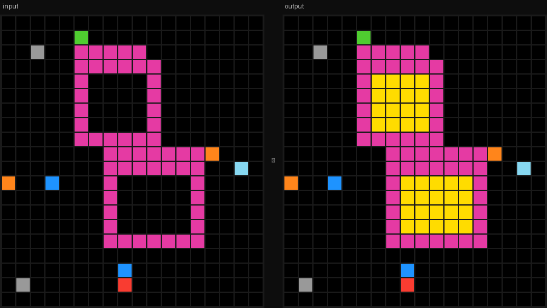

*test instance:*

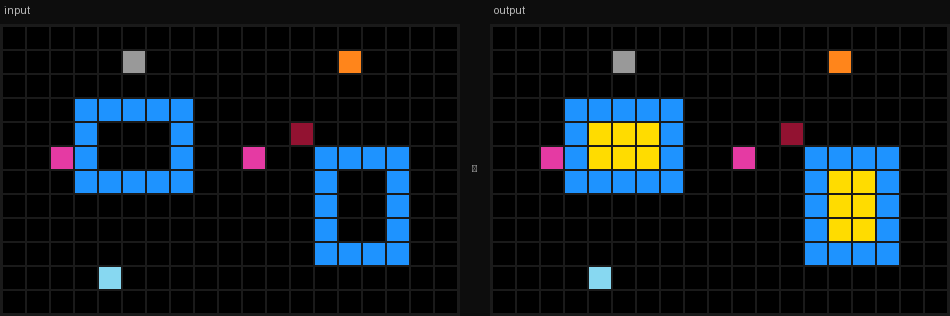

---

## `a9f315ca9cc7`

**Rule:** Self-tile 3×3: each cell of the input determines whether that tile-position copies the input or stays blank

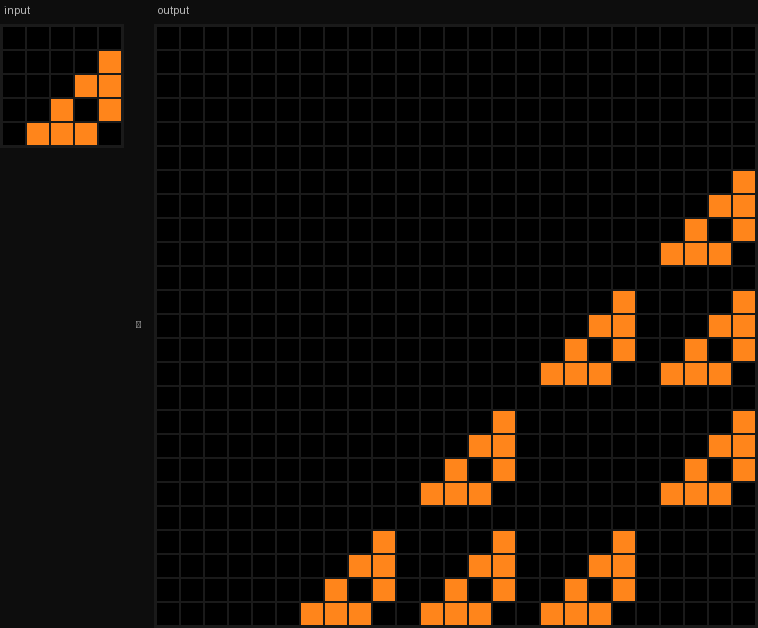

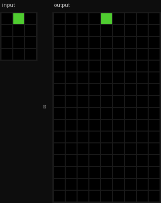

*test instance:*

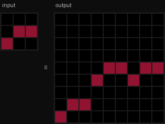

---

## `c739fcbc6cbd`

**Rule:** Repeat a vertical color marker across all columns at the same spacing

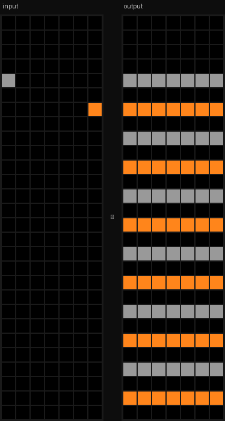

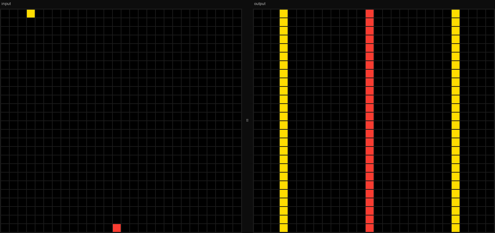

*test instance:*

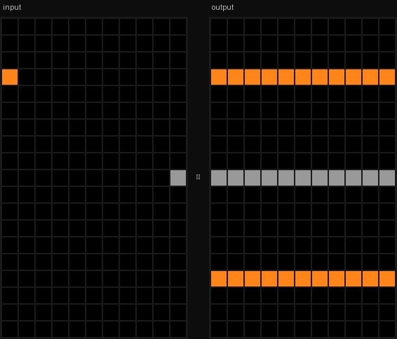

---

To regenerate: `python3 scripts/build_samples.py`